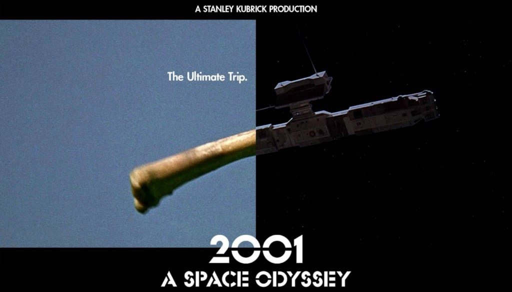

# 1 Imaging Technique Inspiration
## Dissolve and match cut
**Dissolve and Match Cut** are commonly used transition techniques in film and television editing. Connect two shots by using similar shapes, sounds, and movements to complete scene transitions. This connection can tap into the viewer's subconscious mind to create a transition between animations of similarity or difference.

# 2 Coding Technique Exploration

StackEdit stores your files in your browser, which means all your files are automatically saved locally and are accessible **offline!**