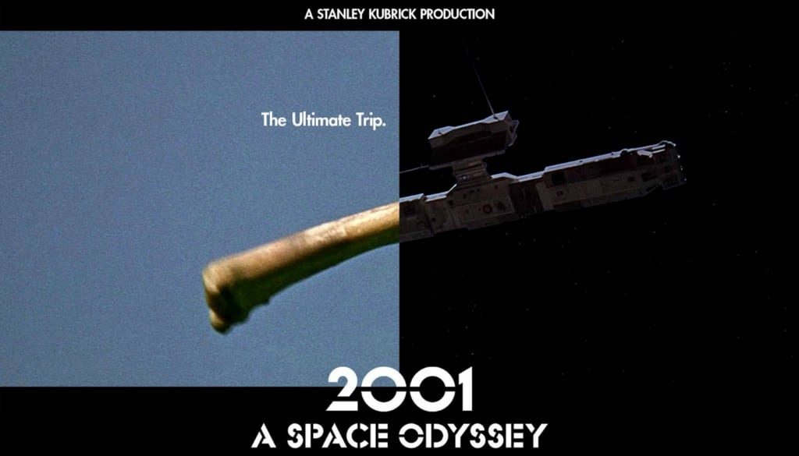
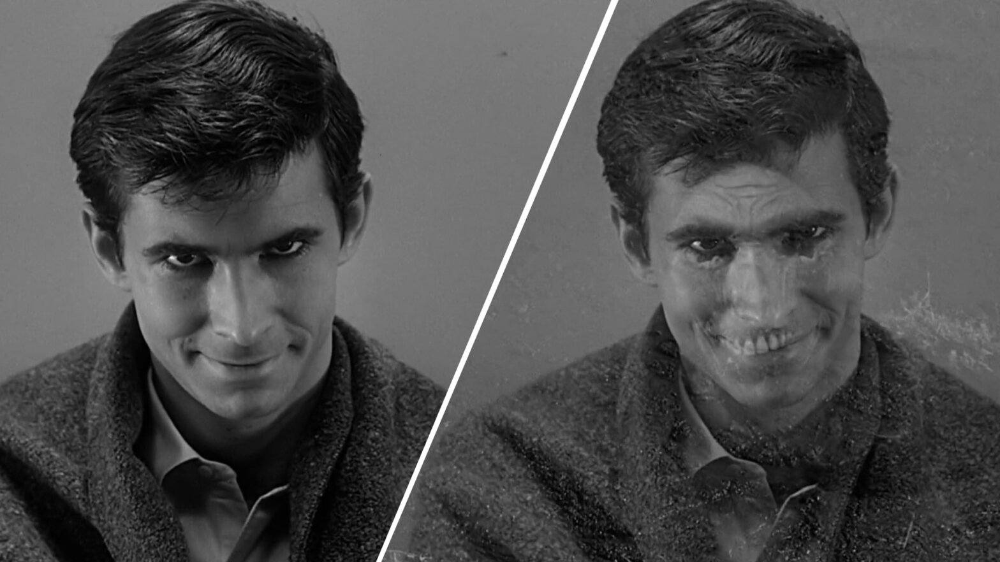
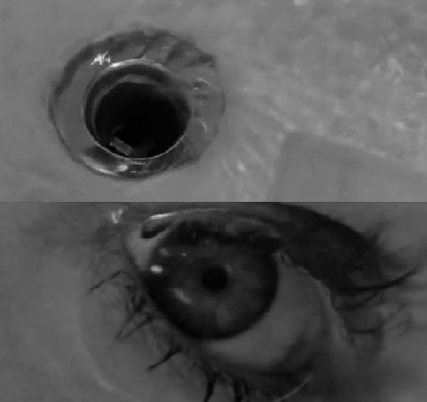

# 1 Imaging Technique Inspiration
## Dissolve and Match Cut
**Dissolve and Match Cut** are commonly used transition techniques in film and television editing. Connect two shots by using similar shapes, sounds, and movements to complete scene transitions. This connection can tap into the viewer's subconscious mind to create a transition between animations of similarity or difference.

In the clip from **2001: A Space Odyssey**, the stick that was thrown into the sky and transformed into a spaceship is an example of a match cut.

In addition, in the famous thriller movie **Psycho**, dissolve and match cut were also used in two very classic scene transitions.

## Incorporation into the Project
Add some interactive mechanisms to the still world famous paintings. When the user interacts with the artwork, the graphics will be converted into commonly recognized shapes of similarity/difference through dissolve and match cut, thereby enriching the user's visual experience.

# 2 Coding Technique Exploration

StackEdit stores your files in your browser, which means all your files are automatically saved locally and are accessible **offline!**